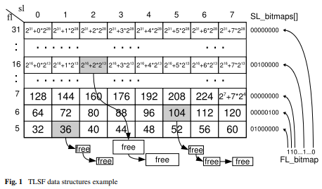
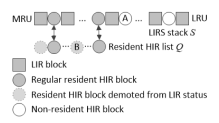

# HTFH-RT-Search-Cache
A real-time search cache build on top of a Hybrid TLSF Fixed Heap allocator with DLIRS mixed-strategy caching.

## TLSF

<http://www.gii.upv.es/tlsf/files/jrts2008.pdf>

## DLIRS

<https://www.systor.org/2018/pdf/systor18-4.pdf>
